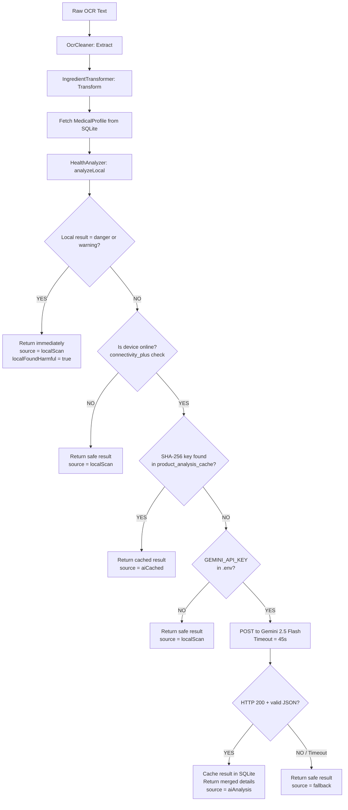

# AI Doctor Eyes — Project Architecture

> **Source of truth:** This document was generated by directly reading the codebase. No assumption was made. If a detail was not found in the code it is explicitly marked as *"Implementation detail not found in codebase."*

---

## 1. Overall Tech Stack

### Runtime Dependencies (`pubspec.yaml`)

| Package | Version | Role |
|---|---|---|
| `flutter` (SDK) | — | UI framework |
| `camera` | `^0.11.0+2` | Live camera preview for scanning |
| `google_mlkit_text_recognition` | `^0.15.0` | On-device OCR engine |
| `image_picker` | `^1.1.2` | Gallery image selection (lab reports) |
| `sqflite` | `^2.4.1` | Local SQLite database |
| `shared_preferences` | `^2.5.3` | Primitive key-value persistence |
| `http` | `^1.2.2` | REST calls to the Gemini API |
| `connectivity_plus` | `6.0.3` | Online/offline state detection |
| `crypto` | `^3.0.3` | SHA-256 cache-key hashing |
| `flutter_dotenv` | `^6.0.0` | `.env` file loading (API key) |
| `path_provider` | `^2.1.3` | File system paths (backup export) |
| `file_picker` | `^8.0.7` | JSON backup import from device |
| `url_launcher` | `^6.1.11` | External link launching |
| `flutter_tts` | `^3.8.3` | Text-to-speech voice feedback |
| `vibration` | `^1.9.0` | Haptic feedback |
| `permission_handler` | `^11.4.0` | Camera/storage runtime permissions |
| `intl` | `^0.18.1` | Date formatting |
| `path` | `^1.9.0` | File path utilities |
| `cupertino_icons` | `^1.0.8` | iOS-style icon set |

### Dev Dependencies

| Package | Role |
|---|---|
| `flutter_test` (SDK) | Unit testing |
| `flutter_lints` | Lint rules |

---

## 2. Core Scanning Algorithm (As Implemented in the Code)

The scanning pipeline lives in `lib/services/ingredient_checker_service.dart` and is composed of three sequential, strictly ordered phases implemented in `lib/logic/`. The entry point is `IngredientCheckerService.analyzeIngredients(rawOcrText, conditions)`.

### Phase 1 — EXTRACT (`OcrCleaner.cleanOcrText`)

**File:** `lib/logic/extractor/ocr_cleaner.dart`

The cleaner takes the raw string from ML Kit and returns a sanitized, comma-joined string of ingredient tokens.

**Step 1.1 — Text Isolation (Keyword Slice)**

The cleaner first attempts to find the start of the ingredients section using a `RegExp`:

```
r'([il1]ngredients|المكونات|المحتويات|contains)\s*[:\-]*'
caseSensitive: false
```

The character class `[il1]` is intentional — it handles common OCR typos where `I` (capital i) is misread as `l` (lowercase L) or `1`.

- **If a match is found:** the string is sliced from `match.end` onward. All content before the keyword (e.g., brand name, nutrition facts header) is permanently discarded.
- **If no match is found:** the full raw string is used as-is. No fallback truncation occurs.

**Step 1.2 — Line-by-Line Noise Filtering**

The sliced text is split on `[\r\n]+`. Each line is checked against two filters:

1. **Nutrition pattern list:** A compiled list of `RegExp` patterns (from `ingredient_constants.dart`) matches lines like `"Total Fat"`, `"Calories"`, `"Sodium 400mg"`, `"% Daily Value"`, `"Serving Size"`, etc. Matching lines are dropped.
2. **Numeric density filter:** For each line, the ratio of numeric/symbol characters to total non-space characters is computed:
   - Numeric/symbol characters are: `0-9`, `%`, `.`, `,`, `:`, `/`, `(`, `)`, `-`.
   - If this ratio exceeds `0.6` (60%), the line is classified as a nutritional value row and dropped.

**Step 1.3 — Assembly**

Surviving lines are joined with `", "`. Consecutive spaces are collapsed to single spaces. The result is returned as a single cleaned string.

---

### Phase 2 — TRANSFORM (`IngredientTransformer.transform`)

**File:** `lib/logic/transformer/ingredient_transformer.dart`

**Step 2.1 — Session Merge Window**

The transformer stores the text from the *previous* scan in `_lastTransformedText`. If the new scan occurs within **30 seconds** of the previous one, the two texts are concatenated with `", "` before tokenization. This handles multi-side product scanning.

**Step 2.2 — Tokenization**

The merged text is split into tokens using the following normalization rules (applied in order):
1. The word `\band\b` is replaced with `,`.
2. The characters `.`, `؛`, `;`, `-` are replaced with `,`.
3. The `&` character is replaced with `,`.
4. The resulting string is split on `,`. Tokens shorter than 2 characters are discarded.

**Step 2.3 — OCR Correction**

Each token is checked against the `ocrCorrections` map (a static `Map<String, String>` in `ingredient_constants.dart`). If a match is found via substring search:
- If the correction value is a non-empty string, the token is replaced.
- If the correction value is `''` (empty string), the token is discarded as noise.

**Step 2.4 — Canonical Name Resolution**

Each surviving token is lowercased and matched against `harmfulKeywords[condition]` for each of the user's selected conditions. If a substring match is found, the canonical display name is retrieved from the `canonicalDisplayName` map (also in `ingredient_constants.dart`). Unmatched tokens are sanitized via `sanitizeIngredientName()` (which strips residual "ingredients:" prefixes, trailing unit suffixes, and applies capitalization).

**Step 2.5 — Deduplication**

A `Set<String>` (`seenCanonical`) tracks lowercase versions of all output names. Any duplicate ingredient is silently dropped, ensuring the `uniqueCanonicalNames` list contains no repetitions.

---

### Phase 3 — ANALYZE (`HealthAnalyzer.analyzeLocal`)

**File:** `lib/logic/analyzer/health_analyzer.dart`

This phase is **fully synchronous** and **fully offline**. It operates on the `uniqueCanonicalNames` list from Phase 2.

**Step 3.1 — Positional Ratio Calculation**

For each ingredient at index `i` in a list of total length `n`, the position ratio is:

```
positionRatio = i / n
```

- Index `0` → `positionRatio = 0.0`
- Last index (`n-1`) → `positionRatio = (n-1) / n` (always `< 1.0`)

This ratio is stored on every `IngredientAnalysis` result and drives both severity labeling and UI rendering.

**Step 3.2 — Tier 1: Medical Profile Override (Checked First)**

If a `MedicalProfile` was fetched from SQLite and its `forbiddenKeywords` list is non-empty, each ingredient name is checked via `lowerName.contains(kw)` (substring, case-insensitive) against every keyword in the profile.

On a match:

| `positionRatio` | `severity` string | `status` |
|---|---|---|
| `<= 0.50` | `'CRITICAL 🚨'` | `IngredientStatus.danger` |
| `> 0.50` | `'WARNING 🩺'` | `IngredientStatus.danger` |

The `isMedicalProfileHit` flag is set to `true`. Processing stops for this ingredient (no Tier 2 check).

**Step 3.3 — Tier 2: Local Keyword Dictionary (Standard Check)**

If Tier 1 did not match, the ingredient is checked against the combined `harmfulKeywords` map for the user's selected conditions.

On a match:

| `positionRatio` | `severity` string | `status` |
|---|---|---|
| `<= 0.33` | `'High Concentration'` | `IngredientStatus.danger` |
| `> 0.33` and `<= 0.66` | `'Medium Amount'` | `IngredientStatus.warning` |
| `> 0.66` | `'Trace Amount'` | `IngredientStatus.trace` |

**Step 3.4 — Safe Default**

If neither tier matched, the ingredient is added with `IngredientStatus.safe`.

**Step 3.5 — Overall Status Aggregation**

After all ingredients are evaluated:
- If any ingredient has `isMedicalProfileHit == true` → overall `IngredientStatus.danger`.
- Else if any ingredient has `status` of `danger`, `warning`, or `trace` → overall `IngredientStatus.warning`.
- Otherwise → overall `IngredientStatus.safe`.

---

## 3. Offline vs. Online Workflow

The decision tree is implemented in `IngredientCheckerService.analyzeIngredients`.



**Key architectural decision found in the code:** The local scan acts as a **short-circuit**. The Gemini API is **never called** if the local scan already found a `danger` or `warning` ingredient. This eliminates unnecessary API costs and latency when the answer is already known.

### AI Cache Key

The cache key used for `product_analysis_cache` is computed as:

```dart
final condStr = (conditions.map((c) => c.name).toList()..sort()).join('|');
final raw = '$cleanedText::$condStr';
key = sha256.convert(utf8.encode(raw)).toString();
```

This ensures the cache is both text-specific and condition-specific.

### AI Result Merging

When the AI returns harmful ingredients, `_mergeDetails` is called. It iterates the AI's `found_harmful` list:
- If a local detail already exists for that ingredient (checked by bidirectional substring match), and its local status is not already `danger`, it is **upgraded to danger** with the reason `"Identified as harmful by AI analysis."`.
- If the ingredient was not found locally at all, it is **appended** as a new `danger` entry.

---

## 4. Data Persistence Strategy

### 4a. SQLite (`database_helper.dart`) — Schema Version 6

| Table | What it stores | How `List<String>` is handled |
|---|---|---|
| `cached_ingredients` | Per-ingredient AI cache (legacy, v2) | N/A |
| `product_analysis_cache` | Full per-product AI analysis result, keyed by SHA-256 hash | `found_harmful` stored as `jsonEncode(List<String>)` |
| `medical_profile` | Single-row: AI-extracted medical condition, forbidden keywords, severity | `forbidden_keywords` stored as `jsonEncode(List<String>)` |
| `lab_records` | Historical log of every scanned lab report | `forbidden_ingredients` stored as `jsonEncode(List<String>)` |

**Exact column schemas:**

```sql
-- v2
CREATE TABLE cached_ingredients (
  id INTEGER PRIMARY KEY AUTOINCREMENT,
  ingredientName TEXT NOT NULL,
  conditionName TEXT NOT NULL,
  status TEXT NOT NULL,
  reason TEXT NOT NULL,
  severity TEXT,
  timestamp INTEGER NOT NULL
)

-- v4
CREATE TABLE IF NOT EXISTS product_analysis_cache (
  id INTEGER PRIMARY KEY AUTOINCREMENT,
  cache_key TEXT NOT NULL UNIQUE,
  conditions TEXT NOT NULL,
  status TEXT NOT NULL,
  found_harmful TEXT NOT NULL,   -- JSON array string
  reason_ar TEXT NOT NULL,
  analysis_en TEXT NOT NULL,
  timestamp INTEGER NOT NULL
)

-- v5
CREATE TABLE IF NOT EXISTS medical_profile (
  id INTEGER PRIMARY KEY AUTOINCREMENT,
  condition TEXT NOT NULL,
  forbidden_keywords TEXT NOT NULL,  -- JSON array string
  severity TEXT NOT NULL,
  last_updated INTEGER NOT NULL      -- Unix ms epoch
)

-- v6
CREATE TABLE IF NOT EXISTS lab_records (
  id INTEGER PRIMARY KEY AUTOINCREMENT,
  date_time INTEGER NOT NULL,              -- Unix ms epoch
  condition_title TEXT NOT NULL,
  forbidden_ingredients TEXT NOT NULL     -- JSON array string
)
```

**`medical_profile` upsert semantics:** The table allows multiple rows physically, but `upsertMedicalProfile()` always executes `DELETE` followed by `INSERT` inside a single transaction, enforcing single-row semantics.

**Backup coverage:** `getAllTablesAsJson()` exports `product_analysis_cache`, `medical_profile`, and `lab_records`. The `cached_ingredients` legacy table is **not** included in backup exports.

### 4b. SharedPreferences (`preferences_service.dart`)

| Key | Type | What it stores |
|---|---|---|
| `selected_health_condition` | `List<String>` (StringList) | User's selected `HealthCondition` enum names |
| `full_name` | `String` | User's full name |
| `year_of_birth` | `int` | User's year of birth (used to compute age for AI prompt) |
| `has_completed_onboarding` | `bool` | Whether the user has passed the welcome screen |
| `vibration_enabled` | `bool` | Haptic feedback toggle (default: `true`) |
| `voice_feedback_enabled` | `bool` | TTS feedback toggle (default: `false`) |

> **Migration note found in code:** There is a backward-compatibility check. If `selected_health_condition` is a plain `String` (old single-condition format), it is read via `getString()` and wrapped in a list.

---

## 5. Medical & Health Logic

### 5a. Supported Conditions (Hardcoded in `HealthCondition` enum)

| Enum value | Display Name | What it monitors |
|---|---|---|
| `diabetes` | Diabetes | Sugar and sweetener intake |
| `glutenAllergy` | Gluten Allergy | Gluten-containing ingredients |
| `nutAllergy` | Nut Allergy | Nut-containing ingredients |
| `hypertension` | Hypertension | Salt and sodium-related ingredients |
| `lactoseIntolerance` | Lactose Intolerance | Dairy and lactose ingredients |
| `vegan` | Vegan | All animal-derived products |
| `keto` | Keto Diet | High-carb ingredients |
| `lowFodmap` | Low FODMAP | Fermentable carbohydrates |
| `shellfishAllergy` | Shellfish Allergy | Shellfish-containing ingredients |
| `soyAllergy` | Soy Allergy | Soy-containing ingredients |

### 5b. Dynamic Condition Support (AI Lab Report)

Conditions not in the enum above (e.g., Chronic Kidney Disease) are handled dynamically. `MedicalAnalysisService.analyzeMedicalReport()` sends the lab report image to `gemini-2.5-flash` with a vision prompt. The response is parsed into `{ "condition": "...", "forbiddenKeywords": [...], "severity": "..." }`. This data is saved to the `medical_profile` SQLite table. On the next product scan, `HealthAnalyzer` reads these keywords from the DB and runs them through the Tier 1 medical override path, giving personalized protection for any condition the AI can identify.

### 5c. Matching Mechanics

All matching in `HealthAnalyzer` is **case-insensitive substring matching** via Dart's `String.contains()`:

```dart
lowerName.contains(kw) // where kw is already lowercased
```

This means a product ingredient like `"Sodium Chloride"` will match the keyword `"sodium"`, and `"Wheat Flour"` will match `"wheat"`.

The `harmfulKeywords` map in `ingredient_constants.dart` provides the static keyword lists per condition. The `canonicalDisplayName` map provides the clean UI display name for each keyword. Shared ingredients across conditions (e.g., `"honey"` appears in both `diabetes` and `keto`) are managed by spreading shared sub-maps to ensure each keyword appears exactly once in `canonicalDisplayName`.
